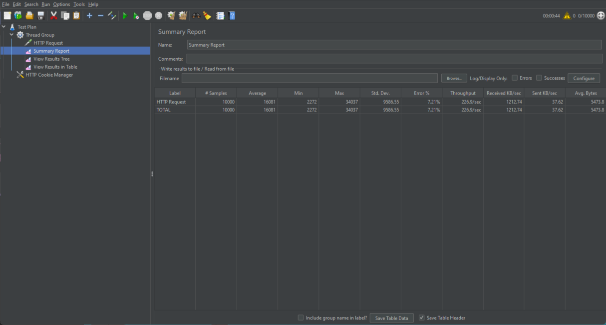
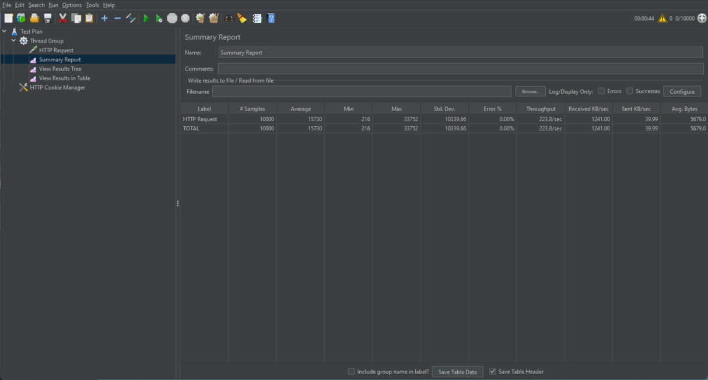
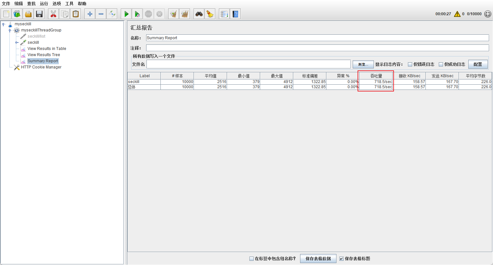
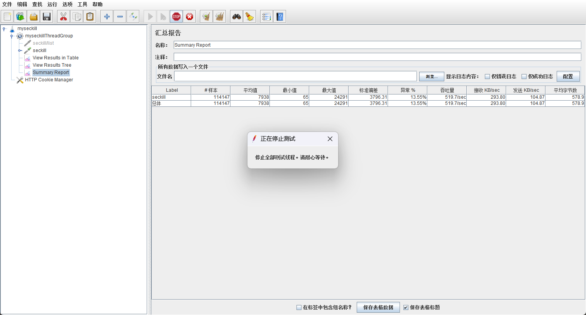
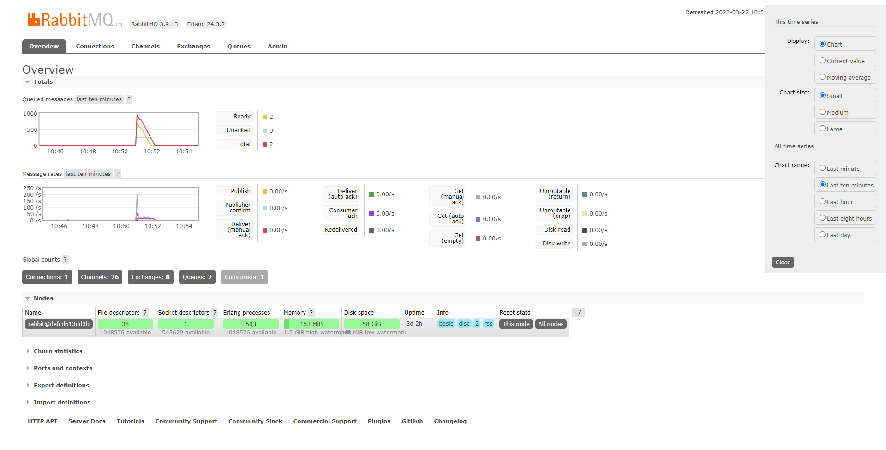

# myseckill

## 基本功能
### 用户
1. - [x] 用户登录保存信息到cooke, redis并设置失效时长2h
2. - [x] 访问请求验证登录优先从redis获取
### 订单
1. - [x] 消费redis生成订单数据
### 商品
## 特性
1. - [X] redis实现热点数据读写
2. - [x] rabbitmq实现流量削峰
3. - [ ] 页面缓存, 对象缓存
4. - [x] 解决高并发下的超卖问题
## 其它
1. - [x] rabbitmq的exchage, queue, routeKey等测试
2. - [X] 测试高并发
- 测试工具, jmeter, 10k线程10s
- 数据库实时查询

- redis缓存读取

- 居然没有差别, 问题出在哪里?
- 经过多次测试， 结果都相差无几。同样需要进行网络请求，为什么需要将热点数据放入缓存？
- 测试了下10K线程10秒内请求10个订单, 使用lua脚本解决超卖问题

- 最后测试了下100w线程10秒请求1000个订单, 通过观察机器运行情况,明显CPU算力成为瓶颈, 在完成秒杀后提前结束测试, 结果如图
  
  
  
## 结论
1. 秒杀场景下, 应对高并发,使用redis lua脚本保证判断库存和扣减库存的原子性
